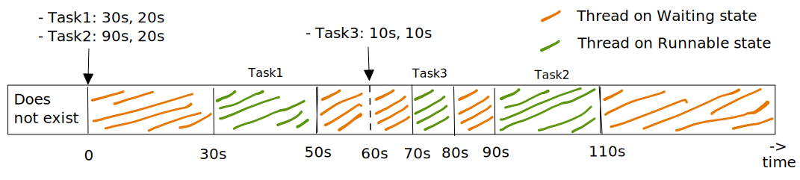

= The Java Timer
:hardbreaks:

How does the `java.util.concurrent.Timer` class work?
How does it schedule the tasks that you give it?
Could you roll out your own implementation, or is it some sort of native concept that ships with the java language itself and cannot be replicated in user code?

Yes. You can definitely roll out your own! You shouldn't use that in production, but understanding it at a fundamental level will make you feel a like 10x programmer.

NOTE: Since Java 5.0, `Timer` went out of favor with the introduction of `java.util.concurrent.ScheduledThreadPoolExecutor`. The latter is more versatile, but unless you need its extra-capabilities, `Timer` is more than adequate.

An instance of `Timer` is associated with a *SINGLE* thread. Every time you create a new instance, a new thread is created. That thread's goes on an infinite loop. On each iteration it checks if there is a task that it should run. It executes it if there is, and then proceeds to the next iteration. This is essentially it.

It may surprise you that it uses time and timestamps to verify if a task is ready to run.
On the other side, the clients of `Timer` (i.e. the portions of the code that hold a reference to it) submit tasks to run 1) once with a delay, or 2) multiple times at a given frequency.
Notice that you can have many clients of `Timer`. Each of which running on a thread - which obviously will be different from the thread the `Timer` creates. The best way to understand the timer is to visualize all these threads interacting through a queue. The client of the `Timer` submit (produce) the tasks, and the *SINGLE* thread of the `Timer` removes (consumes) it and runs it when its time comes. Obviously though, that queue is hidden way from the API.

A corollary to this is that timers are not exact. You can never rely on it to run your task at the *exact* moment that you intend it. That's ok too.

For example, lets say that an instance received 2 tasks to run. The first task should run 5 minutes from now, and the 2nd task 10 minutes from now. If, for whatever reason, that first task takes more than 5 minutes to complete, then, because `Timer` is only backed by a *SINGLE* thread, the 2nd task will only run after the 1st completes, potentially not after exactly 10 minutes. Potentially much later.
The documentation itself warns about this. You should avoid long computations for the tasks submitted to this `Timers.`

== Implementing your own

=== Attempt 1 - Naive approach

.TimerTask
[%collapsible]
====
[,scala]
----
class MyTimerTask private (val runnable: Runnable, val whenToRun: Long) extends Runnable {
    override def run(): Unit = runnable.run()
}

object MyTimerTask {
    def apply(runnable: Runnable, whenToRun: Long): MyTimerTask = new MyTimerTask(runnable, whenToRun)
}
----
====

.Timer
[%collapsible]
====
[,scala]
----
import java.util.concurrent.{BlockingQueue, LinkedBlockingQueue}

class MyTimer private (queue: BlockingQueue) {
  def schedule(runnable: Runnable, delay: Long): Unit =
    queue.put(MyTimerTask(runnable, System.currentTimeMillis() + delay))
}

object MyTimer {
  def apply(): MyTimerImpl = {
    val queue = new LinkedBlockingQueue[MyTimerTask]()

    val timerThread = new Thread(new Runnable {
      override def run(): Unit = while (true) {
        val newElement = queue.take()
        if (System.currentTimeMillis() > newElement.whenToRun) newElement.run()
        else queue.put(MyTimerTask(newElement.runnable, newElement.whenToRun))
      }
    })
    timerThread.setName("TimerThread")
    timerThread.setDaemon(false)
    timerThread.start()
    new MyTimerImpl(queue)
  }
}
----
====

An advantage of this approach is that the thread will not waste CPU time when there are no tasks submitted. This is a nice advantage of using a blocking queue, which puts the thread on a "waiting" state until a 2nd thread pushes a new element/task to it.

A disadvantage is that the timer thread will "spin" - and therefore waste CPU time - until the next task has to be run. If you submit a single task to run 30 minutes from now, for the next 30 minutes, the thread will be continuously looping around. This is wasteful of CPU if during this 30 minutes there are no new tasks submitted.

What you would like the thread to do:
- To be de-scheduled if there are no tasks, and wake up once one is submitted.
- To be de-scheduled **UNTIL** the next task is to be run, **OR UNTIL** a new task is submitted in the meantime, such that it is to be run before the former.

This is what `Timer` does. The diagram shows what the timer thread is doing for the code at [1]:

.Thread states of the thread of a `java.util.concurrent.Timer`.

The timer (and therefore associated thread) is created at around time 0, and immediately after two tasks are submitted. Task 1, schedule to run 30 seconds from now and Task 2, schedule to run 90 seconds from now. Both tasks are just a while loop for 20 seconds.

**Importantly note**
1. For the 1st 30 seconds, there is nothing to do. Adequately the thread sleeps and does not wast CPU. "It knows" exactly when to wake back up.
2. After it runs, it goes back to idle until Task 2 is meant to run.
3. After running Task 2, as there are no more tasks submitted, it correctly goes bak to a "Waiting state".

Question
What would happen if a third task was submitted **at** 60 seconds, when the timer thread was waiting to run Task 2, and such task having a scheduled time of 10 seconds (meaning, it should run at time 70 seconds)?

Well, the `java.util.concurrent.Timer` correctly wakes up prematurely, and is able to run Task 3 **before** Task 2:

.Thread states of the thread of a `java.util.concurrent.Timer`.

But wait, there is more. Notice dashed line at 60 seconds, when Task 3 is introduced? Well, if we were to zoom-in, we would notice that the thread wakes up for a very brief period of time In the order of microseconds. This is necessary off course to verify when the ew Task 3 has to be run and take appropriate action.

==== Another part
Because Timer has only one thread, if a task takes to long, the remaining tasks will not execute when they should. This should be self-evident from the previous detailed analysis.

The `ScheduledThreadPoolExecutor` lessens this problem by having multiple threads that can pick up tasks. __Lessens__ is the appropriate word, as the problem is not fully solved. If more tasks than threads are submitted, **and** each of these takes longer to run than the next is due, this task will be late.